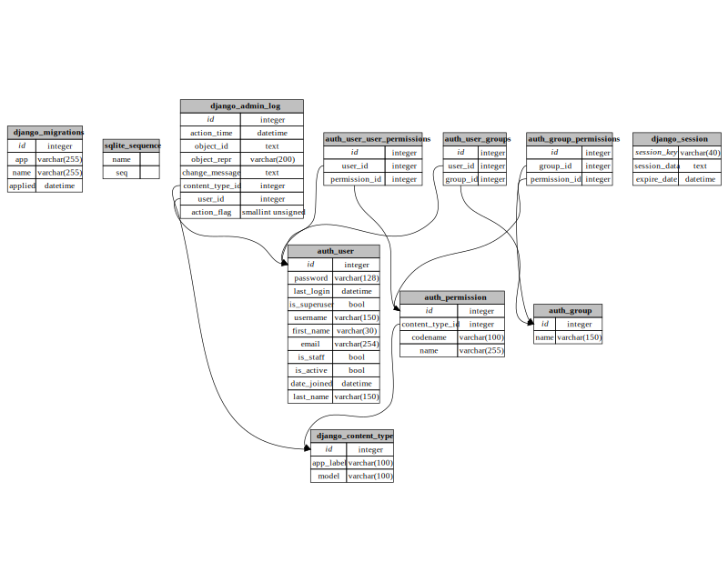

# SQLite3 Schema Crawler

Generate a [GraphViz](https://graphviz.gitlab.io) dot file given a [SQLite3](https://www.sqlite.org/index.html) schema.

## Table of Contents

* [Requirements](#requirements)
* [Installation](#installation)
* [Usage](#usage)
* [Example](#example)

## Requirements

* [Python 3.8 or newer](https://www.python.org/downloads/)

## Installation

Clone this repository using:
```
git clone https://github.com/jlegare/SQLite3-schema-crawler.git
```

## Usage

To generate a GraphViz drawing for a SQLite3 database, provide the path to the database file on the command-line:
```
python schema-crawler.py some-database.sqlite3
```

By default, all tables in the database will be included. This can be controlled using a combination of four options:

* `--include`,
* `--prefix-include`,
* `--exclude`, and
* `--prefix-exclude`.

Each of these options takes a single argument, but each option can be specified multiple times, their values are collected and considered as a whole. There is, however, an order of precedence to their application, namely, the order given above:

* if `--include` is specified, the output will contain only the specified table, otherwise
* if `--prefix-include` is specified, the output will contain tables whose name begins with the specified prefix, otherwise
* if `--exclude` is specified, the output will not contain the specified table, otherwise
* if `--prefix-exclude` is specified, the output will not contain tables whose name begins with the specified prefix, otherwise
* the output will contain every table encountered in the database.

For example, if `db.sqlite3` is a typical [Django](https://www.djangoproject.com) SQLite3 database, we can consider only the _migrations_ table using

```
python schema-crawler.py db.sqlite3 --include django_migrations
```

or all the Django-specific tables using

```
python schema-crawler.py db.sqlite3 --prefix-include django_
```

Similarly, we can consider the complementary set of tables (_i.e._, all tables except `django_migrations` or all tables except the Django-specific tables) using the `--exclude` and `prefix-exclude` options instead.

## Example

If `db.sqlite3` is the database generated by a plain Django project with user authentication included, but no user-defined models, then

```
python schema-crawler.py db.sqlite3
```

will generate (on `stdout`) a `.dot` file that, when run through GraphViz (with appropriate options) will yield the following diagram:


